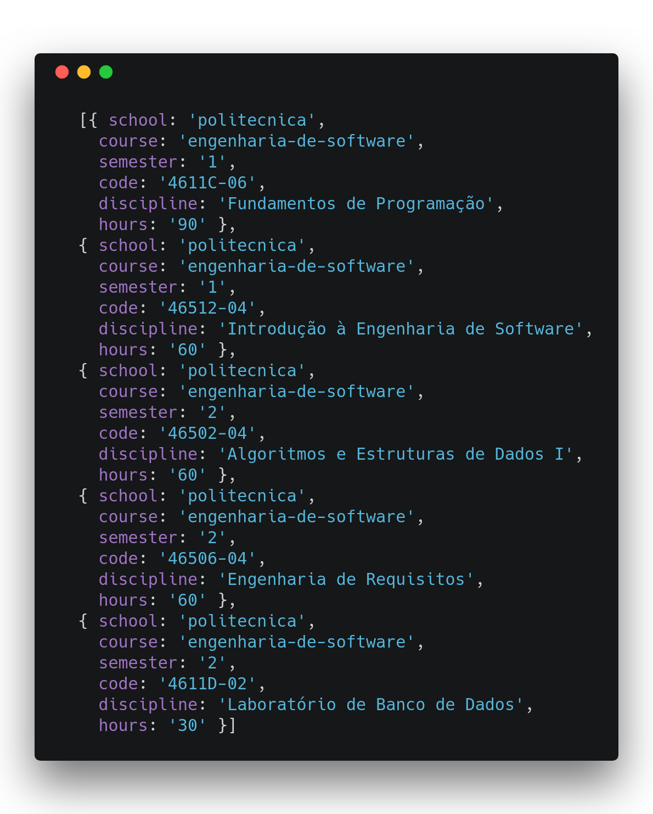

# scraping-pucrs
> Scraping PUCRS courses

## Running

1. Install dependencies: `npm install`
2. Start app: `npm start`
3. Access http://localhost:3000/:school/:course  
   Example: http://localhost:3000/politecnica/engenharia-de-software  

## Results

#### Page:
**PUCRS:** http://www.pucrs.br/politecnica/curso/engenharia-de-software/#curriculos  
**Local:** http://localhost:3000/politecnica/engenharia-de-software

#### Results:  
Examples here: https://github.com/marlonfurtado/scraping-pucrs/tree/master/examples  

  

